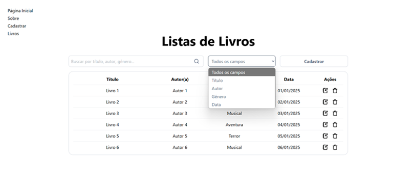
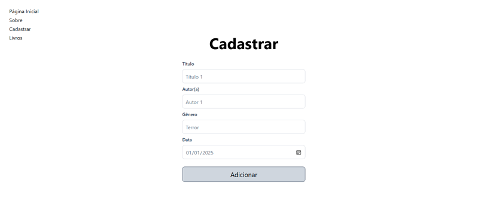
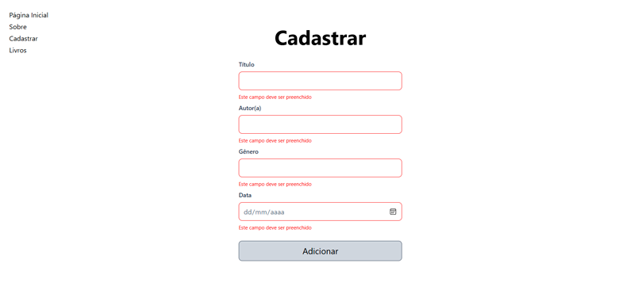
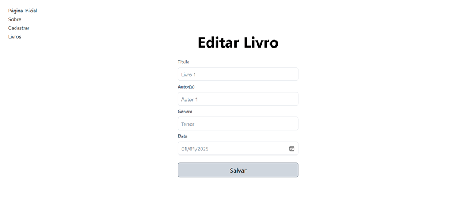
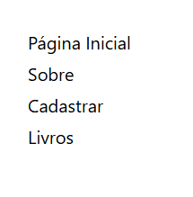

# Sistema de Gerenciamento de Livros - Fase 1

## Nome: Leonardo Ribeiro Santos Cruz

Para executar este projeto:

1. Entre na pasta do projeto no terminal:
  ```
  cd caminho/para/seu/projeto
  ```

2. Rode `npm install` para instalar as dependências do projeto:
  ```
  npm install
  ```

3. E em seguida, `npm run dev`, para iniciar a execução do projeto:
  ```
  npm run dev
  ```

Após a execução do projeto, ele estará disponível no navegador em `http://localhost:3000`.

## Introdução
Este projeto é a Fase 1 de um sistema de gerenciamento de livros, desenvolvido para demonstrar o uso de React com React Router e Context API. A aplicação permite o cadastro, edição, exclusão e visualização de livros, com persistência temporária no `sessionStorage`. A data é armazenada no formato `YYYY-MM-DD` (padrão ISO 8601) e exibida no formato `DD/MM/YYYY` para melhor legibilidade. A interface inclui uma barra de navegação e páginas dedicadas para cada funcionalidade.

## Componentes
Os componentes estão no diretório `./src/components` e possuem as seguintes características:

## Screenshots

Abaixo estão algumas capturas de tela da aplicação, mostrando as principais funcionalidades:

### Lista de Livros


- Esta é a página principal, onde os livros são listados. Inclui um campo de busca com seletor para filtrar por título, autor, gênero, data ou todos os campos.

### Formulário de Cadastro


- Página de cadastro de novos livros, com campos para título, autor, gênero e data.

### validação do Formulário de Cadastro


- Validação do formulário de cadastro dos livros

### Edição de Livro


- Página de edição, onde os dados de um livro existente podem ser alterados.

### Página de Erro


- Página exibida quando uma URL inválida é acessada, como um ID de livro inexistente.

### Barra de Navegação


- Barra de navegação com links para as principais páginas da aplicação.

**BookForm:**
  - **Descrição:** Componente responsável pelo formulário de cadastro de livros. Inclui campos para título, autor, gênero e data, com validação usando `yup` e `react-hook-form`. Após o envio, o livro é adicionado ao contexto e o usuário é redirecionado para a lista de livros.


- **BooksList:**
  - **Descrição:** Componente que exibe a lista de livros em uma tabela. Cada linha inclui botões para editar (ícone `NotebookPen`) e excluir (ícone `Trash`) um livro. A data é formatada para `DD/MM/YYYY` ao ser exibida. Inclui um campo de busca com um ícone (`Search`) que permite filtrar os livros por título, autor, gênero ou data, e um seletor (`<select>`) para escolher o critério de busca (Título, Autor, Gênero, Data ou Todos os campos). Também possui um botão para redirecionar à página de cadastro.

- **InputForm:**
  - **Props:**
    - `title`: Título do campo (ex.: "Título", "Autor(a)").
    - `name`: Nome do campo para validação.
    - `errors`: Objeto de erros para exibir mensagens de validação.
    - `children`: O elemento `<input>` a ser renderizado.
  - **Descrição:** Componente reutilizável para renderizar campos de formulário com título, input e mensagens de erro.

- **NavBar:**
  - **Descrição:** Componente de barra de navegação que utiliza o `useNavigate` do React Router para redirecionar entre as páginas principais (`Página Inicial`, `Cadastrar Livro`, `Lista de Livros`).

Os seguintes componentes estão no diretório `./src/pages`:

- **EditBook:**
  - **Descrição:** Página dedicada para edição de livros. Acessível apenas clicando no ícone de edição na lista. Pré-preenche o formulário com os dados do livro e atualiza o contexto ao salvar. Redireciona para `/not-found` se o ID for inválido.

- **NotFound:**
  - **Descrição:** Página de erro (anteriormente chamada de `404.jsx`) exibida quando uma URL inválida é acessada (ex.: `/edit/:id` com ID inexistente). Inclui um botão para voltar à lista de livros.

- **Books:**
  - **Descrição:** Página que renderiza o componente `BooksList` para exibir a lista de livros.

- **Register:**
  - **Descrição:** Página que renderiza o componente `BookForm` para cadastro de novos livros.

- **Home:**
  - **Descrição:** Página inicial que redireciona automaticamente para a lista de livros.

- **About:**
  - **Descrição:** Página sobre o projeto (pode ser usada para informações adicionais, mas atualmente não está integrada à navegação principal).

Os seguintes utilitários estão no diretório `./src/utils`:

- **bookStorage:**
  - **Descrição:** Contém funções para salvar e recuperar livros do `sessionStorage`.

- **yupValidations/registerBookValidation:**
  - **Descrição:** Define o schema de validação com `yup` para os formulários de cadastro e edição de livros.

Os seguintes utilitários estão no diretório `./src/functions`:

- **formatDate:**
  - **Descrição:** Função utilitária para formatar datas de `YYYY-MM-DD` para `DD/MM/YYYY` ao exibir na interface.

Os seguintes hooks estão no diretório `./src/hooks`:

- **useBookProvider:**
  - **Descrição:** Hook que define o reducer e o estado global usando Context API para gerenciar os livros e as páginas de navegação.

- **useBooks:**
  - **Descrição:** Hook que fornece acesso ao estado e às ações do contexto (`books`, `createBook`, `updateBook`, `deleteBook`).

## Testes

Este projeto inclui uma suíte de testes unitários para garantir a funcionalidade e a robustez dos principais componentes e hooks. Os testes foram implementados usando **Jest** e **React Testing Library**, com mocks para dependências como `react-router-dom` e serviços de API. A cobertura abrange:

- **Componentes**:
  - **`BookForm`**: Verifica a renderização do formulário de cadastro, preenchimento e submissão de novos livros, além da navegação para a lista de livros após o sucesso.
  - **`BooksList`**: Garante que a lista de livros é renderizada corretamente com os dados fornecidos.
  - **`EditBookForm`**: Testa a renderização do formulário de edição com dados pré-preenchidos, a submissão de atualizações e o redirecionamento em caso de livro não encontrado.
  - **`NavBar`**: Valida a renderização dos links de navegação, a aplicação de estilos condicionais para links ativos/inativos e a exibição condicional do logo com base na página atual.

- **Hooks**:
  - **`useBookProvider`**: Testa a recuperação inicial de livros, criação, atualização e exclusão de livros, além do manejo de notificações e erros de API.

### Executando os Testes

Para rodar os testes, siga os passos abaixo:

1. Certifique-se de que as dependências estão instaladas:
```
npm install
```
2. Execute a suíte de testes com:
```
npm test
```

Os testes são executados no modo interativo do Jest, mostrando o progresso e os resultados detalhados. Atualmente, a suíte inclui **17 testes** que cobrem as funcionalidades críticas da aplicação.

### Configuração

Os testes utilizam mocks para isolar dependências externas, como:
- **`react-router-dom`**: Mocks para `useNavigate`, `useLocation` e `useParams` garantem que a navegação e o roteamento sejam testados sem dependências reais.
- **Imagens**: O logo da `NavBar` é mockado para evitar erros de importação de arquivos estáticos.
- **API**: O módulo `api` é mockado para simular respostas de endpoints sem chamadas reais à rede.

Os testes também fazem uso de `MemoryRouter` para simular o roteamento do React Router e `jest.useFakeTimers` para controlar temporizadores em notificações.

Essa abordagem garante que os componentes e hooks sejam testados de forma isolada, confiável e repetível.

## Conclusão
Este projeto atende aos requisitos da Fase 1, implementando um sistema básico de gerenciamento de livros com cadastro, edição e exclusão. A escolha de armazenar a data como `YYYY-MM-DD` foi feita para seguir o padrão ISO 8601, enquanto a exibição em `DD/MM/YYYY` melhora a legibilidade para o público brasileiro. A página de edição foi protegida contra acesso direto, redirecionando para `/not-found` em caso de ID inválido. Algumas melhorias futuras incluem a adição de uma funcionalidade de busca e a migração para persistência permanente com um backend.

## Observação
Este projeto foi deployado e está disponível para acesso online. Você pode visualizar a aplicação em funcionamento através do seguinte link:  
[https://reading-journal-zeta.vercel.app/](https://reading-journal-zeta.vercel.app/)